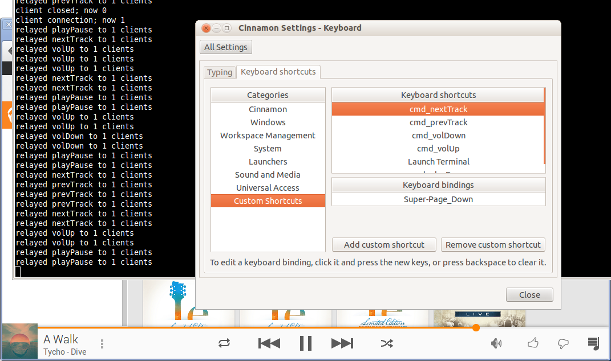

Truly Global Keyboard Shortcuts for Google Play Music
=====================================================

There are several Chrome extensions that offer keyboard shortcuts for Google Play Music, but sadly they only work when Chrome is the foreground app.  Since I spend most of my day between Chrome, an IDE, and the console, I needed truly global shortcuts.

Most Linux desktop environments already make it easy to bind keyboard shortcuts to custom scripts, so I just needed a way to jump into the browser.  The easiest way to push events like this is WebSockets, so I whipped up a local node.js relay server.

The node.js server listens on localhost:8076 for commands from invoked by the global keyboard shortcuts.  It relays those commands to any WebSocket clients connected to localhost:6589.  Finally, a Chrome extension runs in the Google Play Music player where it connects to the node.js server and waits for commands to be pushed to it.

It only has simple features like play/pause, next/previous tracks, and volume controls, but it’s functional enough to let me replace Amarok.  Enjoy!

Usage
-----

Checkout the code, ensure you have node.js and the ws package installed, and run:

    $ sudo apt-get install nodejs npm
    $ npm install ws
    $ node playplay_server.js

Then install the playplay_ext.crx extension in Chrome, and load up Google Play Music.

You can verify everything is working by running the scripts manually from the command line.

    $ ./cmd_playPause.sh

Finally, wire up the shortcuts scripts to your desktop environment, usually under keyboard settings.  For example, in Ubuntu I found them under Applications > System Tools > Preferences > Cinnamon Settings > Keyboard > Keyboard shortcuts > Custom Shortcuts.

HTTPS usage notes
-----------------

Google Play music now uses https. This requires you to generate self-signed ssl
certificates as described here:
http://docs.nodejitsu.com/articles/HTTP/servers/how-to-create-a-HTTPS-server

You can place key.pem and cert.pen directly in ssl-certificates/.

Notes
-----

To get the chrome console:
    Ctrl + Shift + J

To re-package the extension:
    ./make_crx.sh playplay_ext/ ~/.ssh/id_rsa
